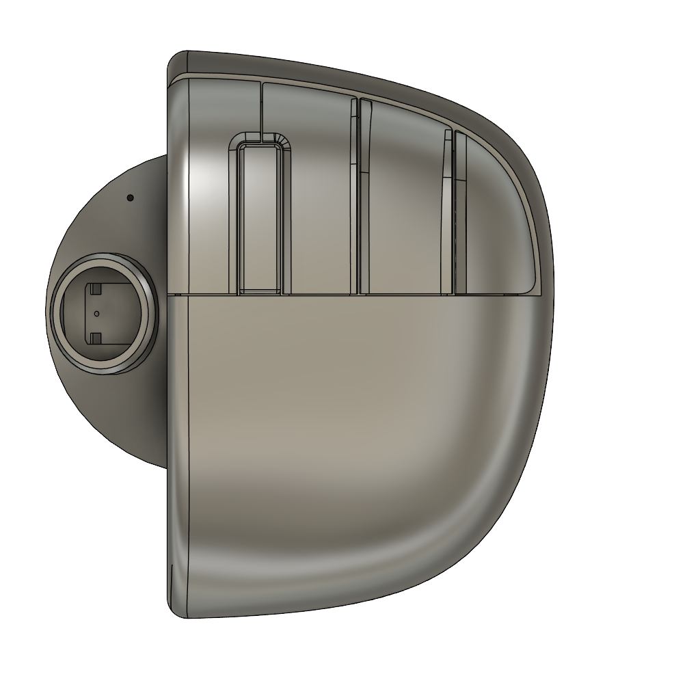

# 概要
片手で操作できるBLEキーボード兼マウスを作るプロジェクトです。
マウスレイヤとキーボードレイヤを切り替えてこのデバイスだけで全ての操作が可能なことを目指します。

# 機能
- [ ] BLE接続先の切り替え(PC/スマホ等)
- [x] レイヤ切り替えでマウス/キーボード
- [x] 未使用時スリープ/使用時即復帰
- [x] キープロファイルの変更・保存
- [x] 各種設定の変更・保存

# 構成部品
| 型名                          | 説明                                 | 個数 | 備考                                                        |
| ----------------------------- | ------------------------------------ | ---- | ----------------------------------------------------------- |
| SeeedStudio XIAO BLE nRF52840 | MCU                                  | 1    |                                                             |
| D2F-01                        | 和音入力等に使用するマイクロスイッチ | 5    |                                                             |
| RKJX21224001                  | 和音入力等に使用するジョイスティック | 1    | https://tech.alpsalpine.com/j/products/detail/RKJX21224001/ |
| Capacitor(1uF)                | スイッチのチャタリング防止用         | 6    |                                                             |
| DTP673450                     | リチウムイオンポリマー電池           | 1    |                                                             |

# レイヤ構造
レイヤはジョイスティック押し込みで切り替え

ボタンは以下の通り
| ボタン名       | 略称 | 説明                       |
| :------------- | ---: | :------------------------- |
| Button_1       |   B1 | 人差し指のボタン           |
| Button_2       |   B2 | 中指のボタン               |
| Button_3       |   B3 | 薬指のボタン               |
| Button_4       |   B4 | 小指のボタン               |
| MiddleButton_1 |   M1 | 人差し指と中指の間のボタン |
| JoyStick_Up    |   JU | ジョイスティック上方向     |
| JoyStick_Down  |   JD | ジョイスティック下方向     |
| JoyStick_Right |   JR | ジョイスティック右方向     |
| JoyStick_Left  |   JL | ジョイスティック左方向     |
| JoyStick_Press |   JP | ジョイスティック押し込み   |

## レイヤ1(マウス/デフォルト)
実装の都合上マウスレイヤのマッピングは変更不可。あとで変更可能にするかも

| ボタン | 挙動             | 変更可 |
| -----: | :--------------- | ------ |
|     JP | レイヤ切り替え   | ×      |
|     JU | マウス移動       | ×      |
|     JD | マウス移動       | ×      |
|     JR | マウス移動       | ×      |
|     JL | マウス移動       | ×      |
|     B1 | 左クリック       | ×      |
|     B2 | 右クリック       | ×      |
|     B3 | 戻る             | ×      |
|     B4 | 進む             | ×      |
|     M1 | -                | ×      |
|  M1-JU | マウスホイール上 | ×      |
|  M1-JD | マウスホイール下 | ×      |
|  M1-JR | マウスホイール右 | ×      |
|  M1-JL | マウスホイール左 | ×      |

## レイヤ2(キーボード)
|         ボタン | 挙動           | 変更可 |
| -------------: | -------------- | ------ |
|             JP | レイヤ切り替え | ×      |
|             JU | Ctrl           | ○      |
|             JD | Shift          | ○      |
|             JR | Fn             | ○      |
|             JL | Alt            | ○      |
|             B1 | Z              | ○      |
|             B2 | C              | ○      |
|             B3 | V              | ○      |
|             B4 | S              | ○      |
|            MB1 | F              | ○      |
|          B1-B2 | A              | ○      |
|          B1-B3 | B              | ○      |
|          B1-B4 | D              | ○      |
|          B1-MB | N              | ○      |
|          B2-B3 | P              | ○      |
|          B2-B4 | E              | ○      |
|          B2-MB | G              | ○      |
|          B3-B4 | H              | ○      |
|          B3-MB | I              | ○      |
|          B4-MB | J              | ○      |
|       B1-B2-B3 | K              | ○      |
|       B1-B2-B4 | L              | ○      |
|       B1-B2-MB | M              | ○      |
|       B1-B3-B4 | O              | ○      |
|       B1-B3-MB | Q              | ○      |
|       B1-B4-MB | R              | ○      |
|       B2-B3-B4 | T              | ○      |
|       B2-B3-MB | U              | ○      |
|       B2-B4-MB | W              | ○      |
|       B3-B4-MB | X              | ○      |
|    B1-B2-B3-B4 | Y              | ○      |
|    B1-B2-B3-MB | -              | ○      |
|    B1-B2-B4-MB | -              | ○      |
|    B1-B3-B4-MB | -              | ○      |
|    B2-B3-B4-MB | -              | ○      |
| B1-B2-B3-B4-MB | -              | ○      |

## Fnキー同時押し
|         ボタン | 挙動      | 変更可 |
| -------------: | --------- | ------ |
|             B1 | Enter     | ○      |
|             B2 | Space     | ○      |
|             B3 | Tab       | ○      |
|             B4 | BackSpace | ○      |
|            MB1 | Han/Zen   | ○      |
|          B1-B2 | Del       | ○      |
|          B1-B3 | (         | ○      |
|          B1-B4 | )         | ○      |
|          B1-MB | <         | ○      |
|          B2-B3 | >         | ○      |
|          B2-B4 | \         | ○      |
|          B2-MB | :         | ○      |
|          B3-B4 | ;         | ○      |
|          B3-MB | @         | ○      |
|          B4-MB | !         | ○      |
|       B1-B2-B3 | 0         | ○      |
|       B1-B2-B4 | 1         | ○      |
|       B1-B2-MB | 2         | ○      |
|       B1-B3-B4 | 3         | ○      |
|       B1-B3-MB | 4         | ○      |
|       B1-B4-MB | 5         | ○      |
|       B2-B3-B4 | 6         | ○      |
|       B2-B3-MB | 7         | ○      |
|       B2-B4-MB | 8         | ○      |
|       B3-B4-MB | 9         | ○      |
|    B1-B2-B3-B4 | -         | ○      |
|    B1-B2-B3-MB | -         | ○      |
|    B1-B2-B4-MB | -         | ○      |
|    B1-B3-B4-MB | -         | ○      |
|    B2-B3-B4-MB | -         | ○      |
| B1-B2-B3-B4-MB | -         | ○      |

# スリープ
未操作から60秒(変更可)でスリープモードへ移行。スリープ中もBLE接続は維持される。
ボタン押下、ジョイスティック操作で復帰する。
